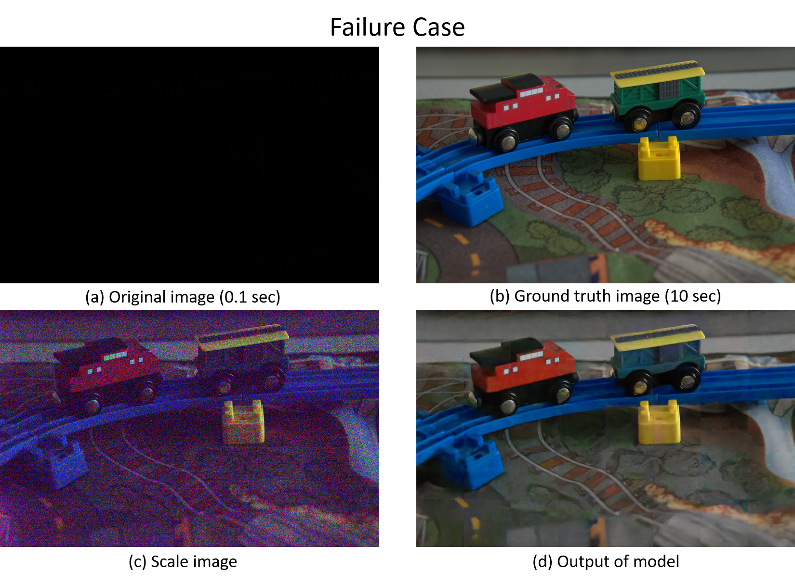

# pytorch-Learning-to-See-in-the-Dark
Learning to See in the Dark using PyTorch 0.4.0 and 1.0.0


### Original tensorflow version
Chen Chen, Qifeng Chen, Jia Xu, and Vladlen Koltun, "Learning to See in the Dark", in CVPR, 2018. <br/>
[Tensorflow code](https://github.com/cchen156/Learning-to-See-in-the-Dark) <br/>
[Paper](http://cchen156.web.engr.illinois.edu/paper/18CVPR_SID.pdf)


## Requirements
- 64 GB RAM
- GTX 1080
- PyTorch >= 0.4.0 (1.0.0 and 1.6.0  are also tested)
- RawPy >= 0.10 (0.15 is also tested)

The program have been tested on Ubuntu 18.04, 16.04, and Windows 10.

## Download Dataset
Download the dataset following the instruction in the [original code](https://github.com/cchen156/Learning-to-See-in-the-Dark) and unzip it under the directory `dataset`.

```
pytorch-Learning-to-See-in-the-Dark
  ├── dataset
  │   ├── image-here
  │   ├── Sony
  │   │   ├── long
  |   │   ├── short
  .   .   .
```

## Training
`python train_Sony.py`
- It will save model and generate result images every 100 epochs. 
- The trained models will be saved in `saved_model/` and the result images will be saved in `result_Sony/`.
- The result of the current output is displayed on the right side of the image file with the ground truth counter part shown on the left side.

## Testing
### Download trained model
You can download the trained pytorch model [here](https://drive.google.com/file/d/1qVYtDEObRAox8SDH4Tbqs2s117v7tFWG/view?usp=sharing) and put it in folder `saved_model/`. <br/>

`python test_Sony.py`

- The trained model is only for `.ARW` photos taken by Sony cameras.
- Pytorch somehow needs more GPU resources than Tensorflow. Therefore, it is impossible to take in the whole image.
- Testing will only take 1024 * 1024 pixels from the test images. 
- This testing script is only for checking the performance of the trained model.
- The result will be saved in `test_result_Sony` with `gt` as ground truth images, `scale` as scaled images, `ori` as input images, and `out` as output images.

### Todo
I have tried to feed the sliced input images into the model and put the result back to the original size. But there still remains two problems:
1. The edges of the sliced input images are quite obvious in the recovered result images.
2. There is no padding SAME in pytorch. Hence, images with incompetible shape might result in errors.


### License
MIT License.

Please contact me you have any questions. [twotwolavi@gmail.com](twotwolavi@gmail.com)
